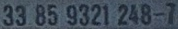
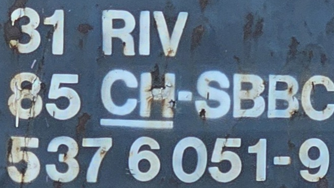

# Rail_OCR
Rail_OCR is a powerful and efficient Optical Character Recognition (OCR) tool specifically designed for the railway industry. This project aims to automatically recognize and extract texts and characters from railway-related surfaces such as vehicles and signs.

# Features:
* Accurate Text Recognition: Utilizes advanced OCR algorithms for precise rail-specific text recognition.
* Reads one-line and three-line EVNs with very high accuracy.
* Images to be processed must already be cropped. See example images. If you need a detection algorithm that crops the EVNs from random pictures, contact me.
* The algorithm can determine whether it has correctly recognized an EVN or not.
* Speed with RTX4090: 20 FPS / 50ms per image.

One-line EVN:

Three-line EVN:

# Upcoming Features:
* Recognition of EVNs in night shots.
* Recognition of hazardous materials (Gefahrengüter). If you prefer to recognize characters from other objects, let me know.
* Further accuracy improvements through fine-tuning with 2 million EVN images.

# Installation:
Clone the repository: git clone https://github.com/msommerfe/Rail_OCR.git
Navigate to the directory: cd Rail_OCR
Install the dependencies: pip install -r requirements.txt

# Usage:
To use this project, you can follow the example code provided in main.py. This example demonstrates how to utilize the Rail_OCR class to predict EVN (European Vehicle Number) from cropped images.

# Contribution:
Contributions are welcome! Please fork the repository and open a pull request with your changes. Ensure you adhere to the existing coding guidelines.

# Customization and Consulting:
For individual fine-tuning, extensions, or custom work, feel free to contact me. We are ready to tailor the solution to your specific needs.

License:
This project is licensed under the Apache 2.0. See the LICENSE file for more details.

BTW: Apache 207 best musician ever
